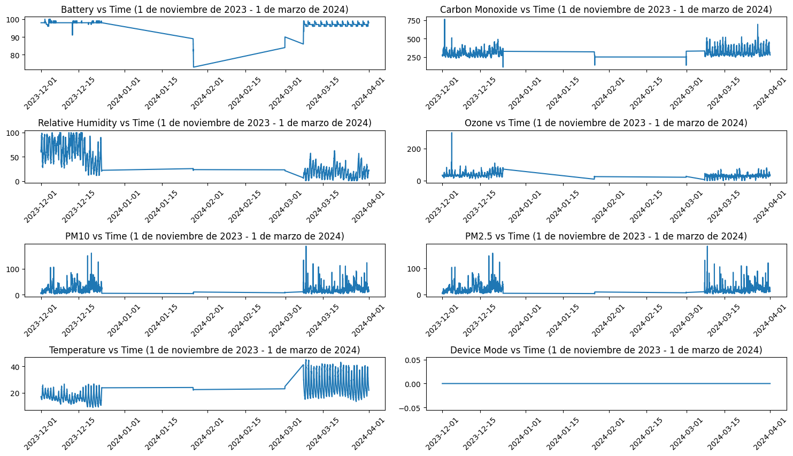

# DATOS PROCESADOS
    Detecto air_quality_data_4 que las coordenadas no definen donde se encuentran los sensores, podemos inferir que todos los sensores son de una misma estacion sin embargo hay diferentes coordenadas en este csv, supondre una sola coordenada " "

    IAS IAQ No estan bien definidos.

# ERRORES
    Se detecta el siguiente error en el funcionamiento del sensor, fallo durante un periodo de 2024 **Puede llegar a funcionar este error como una alarma de fallo del sistema y conocer el comportamiento del dispositivo y/o entrenar alertas del fallo del mismo**
    

# Análisis de los datos
    Observando los valores diarios se pueden ver picos completamente variables entre captura de dato y captura de dato.

    Me he topado con este tipo de errores y, bueno, dependiendo la aplicacion del dispositivo puede que no sea necesario hacer nada mas que aplicar un filtro a los datos. Sin embargo no estamos teniendo lecturas reales, les comento algo mas sobre este fallo:

     * El dispositivo entra en un DeepSleep desconectando todo y perdiendo el estado anterior del sensor, cuando se reactiva, toma la lectura inmediata sin ser la real del momento.

     * Los sensores necesitan un ***warm_time***, si este no se da, se obtienen solo picos de valores, no los reales.

     * Desgaste del sensor con respecto al tiempo.

     * Ruido electrico o interferencias.
    
    Si se buscara un dato real sin entrar en temas del calentamiento del sensor, seria necesario entrenar este mismo dispositivo con respecto a un medidor patron que tome lecturas justo al lado de la estación.

# Correlaciones
    De forma general
        Correlacion negativa entre Humedad/Temperatura
        Correlacion positiva entre PM2.5/PM10
    
